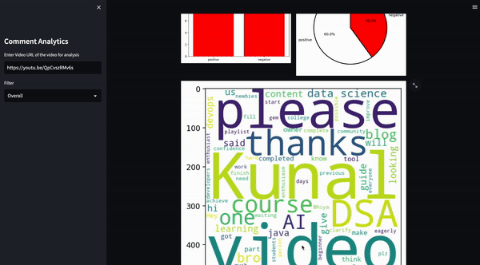

# Youtube Comment Analystics
#### Harnessing Natural Language Processing for valuable insights

In today's age content creator face with the challenge of understanding there audience 
feedback to improve there content quality. Majority of these 
feedbacks are found in comments section in the form of comments. It may get hectic to analyse these comments manaually.
This project aims to harness the power of Data Analysis and NLP to give valuable insights to the creator.


**Working** : This app uses the Youtube API to fetch the youtube comments given URL of the video. This comments are passed to Hugging Face NLP transformer pipeline to perform sentiment analysis on the comments. The analysis helps the app to generate graphs with Matplotlib and give insigths through graphs

**Tools**
- Selenium
- Streamlit
- Pandas
- Hugging Face
- Matplotlib

## Run Locally

Clone the project

```bash
git clone git@github.com:pranavvp16/YT_comment_analysis.git
```

Install dependencies

```bash
pip install -r requirements.txt
```

Start the server

```bash
streamlit run app.py
```

## Working demo and UI of the website


Features to be added:
- [ ] NLP techniques to identify questions in comments
- [ ] Finetune BERT model for youtube comments classification
- [ ] Train BERT model for Spam and Ham filtering to remove unnecessary comments
- [ ] Shift to Flask Framework of Python
- [ ] Perform topic modeling techniques like LDA(Latent Dirichlet Allocation) to find trending topics in the comments
- [ ] Add feature to summarise a specific video.

Please feel free to make pull request if you can add on the above or any 
necessary features to the app
